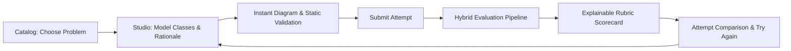
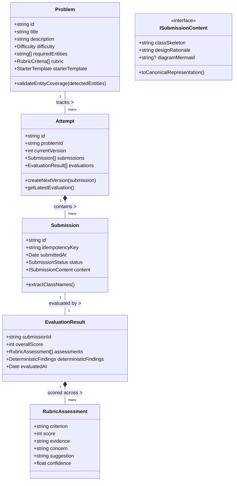

# Design Note: LLD Practice Platform Architecture & Domain Model

## 1. System Overview & Product MVP

The **LLD Practice Platform** is a domain-driven, single-monolith application engineered to support an iterative practice experience for software engineers preparing for Low-Level Design interviews and real-world system modeling.

### 1.1 The Practice Flow


---

## 2. Core Domain Model (LLD Focus)

The domain is organized under Clean Architecture principles with zero external framework dependencies in the core business rules (`src/core/domain/`).



### 2.1 Class Responsibilities & Boundaries

| Class / Interface | Core Responsibility | Why This Abstraction Exists |
|---|---|---|
| `Problem` | Holds requirements, domain context, required entity checklist, and evaluation criteria. | Decouples problem definitions from how learners submit solutions. |
| `Attempt` | Aggregate Root managing a learner's progression for a problem across multiple submission versions. | Ensures attempt versioning, history retention, and state transitions are transactionally coherent. |
| `Submission` | Entity capturing a single snapshot of a learner's work at a point in time, with an idempotency key. | Guarantees immutability of submitted work and deduplication of retries. |
| `ISubmissionContent` | Abstract strategy representing the candidate's work (code skeleton, rationale, diagram). | Encapsulates submission representation; enables **Change Test A**. |
| `EvaluationResult` | Value object containing structured scorecards, evidence citations, and deterministic findings. | Provides a consistent, explainable payload for the UI and progression diffing. |
| `RubricAssessment` | Granular assessment per criterion (`score, evidence, concern, suggestion, confidence`). | Prevents unconstrained "100-point AI hallucination", enforcing evidence-backed critique. |

---

## 3. The Two Change Tests (Architectural Extensibility)

The Candidate Helping Guide specifies two critical architectural tests. Here is how our design handles them without modification to core workflows:

### 3.1 Change Test A: Supporting New Submission Formats
> *"Today the learner submits text/code. Later the platform supports a class diagram or visual canvas. How much of your domain model changes?"*

- **Zero changes to `Problem`, `Attempt`, or the `EvaluationCoordinator`**.
- `Submission` accepts an `ISubmissionContent` strategy:
  ```typescript
  interface ISubmissionContent {
    getType(): 'structured-text' | 'class-diagram' | 'ast-code' | 'multi-part';
    getStructuralRepresentation(): StructuralModel;
    getRationaleText(): string;
  }
  ```
- When visual class diagram submissions are introduced, we simply implement `MermaidDiagramContent` or `UMLCanvasContent` implementing `ISubmissionContent`. The deterministic evaluator consumes `getStructuralRepresentation()`, completely isolated from how the data was captured.

### 3.2 Change Test B: Adding New Evaluators (Rules, AI, Human Review)
> *"Today feedback comes from one evaluator. Later you add a rule-based evaluator or human review. Can you add it without rewriting the practice flow?"*

- We use the **Composite Pattern** & **Strategy Pattern**:
  ```typescript
  interface IEvaluationStrategy {
    readonly name: string;
    evaluate(submission: Submission, problem: Problem): Promise<StageEvaluationResult>;
  }
  ```
- The `CompositeEvaluator` runs registered strategies in sequence:
  1. `DeterministicEvaluator` (Entity completeness, God class checks)
  2. `AIEvaluator` (Qualitative trade-off & SOLID analysis)
  3. `HumanReviewEvaluator` *(Future plug-in)*
- The practice service (`PracticeService.submitAttempt`) interacts only with the top-level `IEvaluator` abstraction. Adding human review or custom AST linters requires zero changes to the practice flow or domain state machine.

---

## 4. Evaluation Strategy: Deterministic vs. AI Division

We strictly delineate deterministic and probabilistic responsibilities:

```
                          ┌──────────────────────────┐
                          │   Learner Submission     │
                          └─────────────┬────────────┘
                                        │
                         [Stage 1: Deterministic Engine]
                         - Schema & Syntax Validation
                         - Required Domain Entity Matrix
                         - Anti-Pattern Linting (God Objects)
                         - Interface Decoupling Checks
                                        │
                                        ▼
                         [Stage 2: AI Reasoning Engine]
                         - SOLID Principles Adherence
                         - Cohesion & Responsibility Quality
                         - Trade-off Justification Analysis
                         - Actionable "Next Attempt" Guidance
                                        │
                                        ▼
                         [Stage 3: Result Synthesizer]
                         - Merge Evidence & Findings
                         - Generate Rubric Assessment Table
                         - Compute Progression Delta
```

### 4.1 Fixed Rubric Model
Rather than asking an LLM *"Is this a good design?"*, evaluation is strictly constrained to 5 structured criteria:
1. **Requirement Coverage & Domain Completeness** (Do entities match problem bounds?)
2. **Single Responsibility & Cohesion** (Does each class own one reason to change?)
3. **Coupling & Abstraction (SOLID)** (Are interfaces used to decouple subsystems?)
4. **Extensibility & Pattern Appropriateness** (Are design patterns used judiciously?)
5. **Quality of Reasoning & Trade-off Awareness** (Does the rationale justify decisions?)

Each criterion must yield:
`{ criterion, score (1-5), evidence, concern, suggestion, confidence }`.

---

## 5. Practical Scale & Reliability (Engineering Judgement)

Per Section 10 of the Candidate Helping Guide, we prioritize practical resilience over over-engineered microservices:

1. **Storage Before Evaluation**:
   - When a submission is posted, it is immediately persisted in `Attempt.submissions` with status `SUBMITTED`. If the evaluation worker crashes or times out, user work is never lost.
2. **Explicit State Transitions**:
   - `SUBMITTED` $\rightarrow$ `EVALUATING` $\rightarrow$ `COMPLETED` or `FAILED`.
   - The UI displays live step progress. If evaluation fails, the attempt records the diagnostic reason and offers an immediate single-click `Retry`.
3. **Idempotency & Duplicate Suppression**:
   - Every submission computes an SHA-256 hash of its contents (`idempotencyKey`). If a duplicate request arrives while evaluating, the existing job is returned rather than triggering duplicate AI calls.
4. **Fallback on AI Timeout**:
   - If an LLM provider takes $> 8$ seconds or encounters a rate limit, the pipeline falls back gracefully to the **Deterministic Findings Report** with an informative banner, ensuring the learner is never left hanging.
5. **Component Separation Roadmap**:
   - If user volume expands, the first component to decouple is the `EvaluationWorker` into an asynchronous Redis/BullMQ worker queue, keeping the web API completely non-blocking.

---

## 6. Trade-offs & Deliberate Limitations

1. **Monolith vs Microservices**: Built as a cohesive modular monolith in TypeScript. A microservice split would add distributed tracing, network latency, and serialization overhead with zero user value for an MVP.
2. **AST Compilation vs Regex Structural Parser**: While a full TypeScript compiler AST is possible, our lightweight regex/heuristic structural extractor runs in $< 5\text{ms}$ in-process without needing an isolated Docker container for compilation.
3. **Dual-Mode AI Evaluator**: To guarantee 100% out-of-the-box demonstrability without demanding paid API keys from reviewers, the platform ships with a high-fidelity deterministic reasoning evaluator, while providing a pluggable adapter for live Gemini/OpenAI API keys via environment variables or UI settings.
