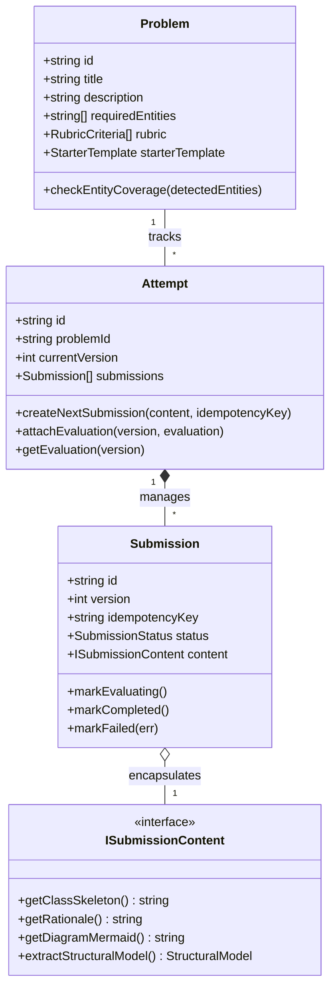

# LLD Practice Platform — System Guide & AI Usage Report

> **Comprehensive Documentation**: System Overview, Getting Started, Domain Architecture, Key Decisions, Limitations, and the Required AI Usage Report.

---

## Table of Contents
- [Part 1: System Guide & README](#part-1-system-guide--readme)
  - [1. Project Overview](#1-project-overview)
  - [2. Quick Start & Setup](#2-quick-start--setup)
  - [3. Core Domain Architecture](#3-core-domain-architecture)
  - [4. Passing the Candidate Guide's Two Change Tests](#4-passing-the-candidate-guides-two-change-tests)
  - [5. Hybrid Evaluation Pipeline](#5-hybrid-evaluation-pipeline)
  - [6. Key Decisions & Known Limitations](#6-key-decisions--known-limitations)
- [Part 2: Required AI Usage Report](#part-2-required-ai-usage-report)
  - [Decision 1: Submission Modality — Sandboxed Execution vs. Structured Skeletons](#decision-1-submission-modality--sandboxed-execution-vs-structured-skeletons)
  - [Decision 2: Evaluation Scoring — Open-Ended 0–100 vs. Grounded Rubric](#decision-2-evaluation-scoring--open-ended-0100-vs-grounded-rubric)
  - [Decision 3: Extensibility & The Two Change Tests](#decision-3-extensibility--the-two-change-tests)
  - [Decision 4: Infrastructure Scope — Distributed Queues vs. Modular Monolith](#decision-4-infrastructure-scope--distributed-queues-vs-modular-monolith)

---

# Part 1: System Guide & README

## 1. Project Overview

**LLD Practice Platform** is a domain-driven web application designed to help engineers bridge the gap between solving coding problems and architecting scalable, decoupled, and maintainable software systems.

Unlike algorithmic platforms (e.g., LeetCode) where code evaluation is binary (pass/fail tests), object-oriented design is fundamentally about **trade-offs, responsibility partitioning, and decoupled abstractions**.

### Core Platform Capabilities
- **Curated Real-World Problems**: Scenario-driven LLD challenges (e.g., *Multi-Floor Parking Lot System*, *High-Rise Elevator Dispatching System*) with explicit domain entity requirements, starter code, and scoring rubrics.
- **Three-Panel Studio Workspace**:
  - **Left Panel**: Problem specification, requirements checklist, and real-time entity detection.
  - **Center Panel**: Multi-tab editor with TypeScript skeleton code, live visual Mermaid UML class diagram, and design rationale notes.
  - **Right Panel**: AI Architect scorecard displaying rubric ratings, anti-pattern diagnostics, and attempt progression diffs.
- **Hybrid Evaluation Pipeline**: Combines deterministic static checks (detects God Classes with $\ge 6$ methods, missing interface abstractions, and concept coverage) with an AI architectural judgment engine that cites exact code evidence.
- **Version Progression & Comparison**: Automated versioning ($v1 \rightarrow v2$) with an interactive modal highlighting resolved concerns and score improvements.
- **100% Uptime Resilience**: Runs on a Node server or Vercel Serverless, backed by an intelligent in-browser fallback service ensuring zero downtime during network latency or cold starts.

---

## 2. Quick Start & Setup

### Prerequisites
- **Node.js**: `v18.0.0` or higher
- **npm**: `v9.0.0` or higher

### Installation & Local Run

```bash
# 1. Clone the repository
git clone https://github.com/utkarshofficial999/LLD-Practice-Platform-assignment.git
cd LLD-Practice-Platform-assignment

# 2. Install dependencies
npm install

# 3. (Optional) Configure environment
# Create a .env file in the root directory:
echo "GROQ_API_KEY=your_groq_api_key_here" > .env
# Note: If left blank, the platform automatically uses its built-in local evaluator.

# 4. Start the application (runs Express API on :3001 and Vite client on :5173 concurrently)
npm run dev

# 5. Open in browser
# Navigate to: http://localhost:5173
```

### Running Automated Tests
```bash
# Run all 9 Vitest suites once:
npm test

# Run tests in interactive watch mode:
npm run test:watch
```

---

## 3. Core Domain Architecture

The core domain layer (`src/core/domain/`) strictly follows **Clean Architecture** and has zero external framework dependencies:



### Primary Domain Concepts
1. **`Problem`**: Holds the problem statement, required domain concepts (`ParkingSpot`, `Ticket`, `PaymentStrategy`), key expectations, and rubric criteria.
2. **`Attempt` (Aggregate Root)**: Manages a candidate's practice session. Tracks an immutable history of submissions (`Submission[]`) and maps them to versioned evaluations (`EvaluationResult[]`).
3. **`Submission` (Entity)**: Captures a candidate's design at a specific point in time. Governs an explicit state machine (`SUBMITTED` $\rightarrow$ `EVALUATING` $\rightarrow$ `COMPLETED` / `FAILED`) with idempotency guarantees.
4. **`ISubmissionContent` (Strategy Pattern)**: Encapsulates submission representations (Code Skeleton, Live UML Diagram, Design Rationale) without leaking formatting details to evaluators.
5. **`PracticeService`**: Application service orchestrating the full end-to-end loop (`listProblems`, `startAttempt`, `submitAttempt`, `compareAttemptVersions`).

---

## 4. Passing the Candidate Guide's Two Change Tests

The Candidate Helping Guide emphasizes that great low-level design must be resilient to changing requirements. Our architecture passes both change tests cleanly:

### Change Test A: New Submission Formats
> *"Today the learner submits text/code. Later the platform supports a class diagram or JSON canvas. How much of your domain model changes?"*

- **Impact**: **Zero changes** to `Problem`, `Attempt`, or any `Evaluator`.
- **Reason**: `Submission` accepts an `ISubmissionContent` strategy interface. Supporting an interactive visual canvas or JSON format only requires creating a new class (e.g., `CanvasSubmissionContent`) implementing `ISubmissionContent`.
- **Validation**: Verified in unit tests [`tests/change_tests.test.ts`](file:///e:/LLD%20Practice%20Platform/tests/change_tests.test.ts).

### Change Test B: New Evaluation Strategies
> *"Today feedback comes from one evaluator. Later you add a rule-based evaluator or human review. Can you add it without rewriting the practice flow?"*

- **Impact**: **Zero changes** to `PracticeService` or `Attempt`.
- **Reason**: Evaluators implement `IEvaluationStrategy` orchestrated via `CompositeEvaluator`. Adding human reviewers, peer grading, or AST linters is as simple as calling:
  ```typescript
  composite.addStrategy(new HumanReviewEvaluator());
  ```
- **Validation**: Verified in unit tests [`tests/change_tests.test.ts`](file:///e:/LLD%20Practice%20Platform/tests/change_tests.test.ts).

---

## 5. Hybrid Evaluation Pipeline

| Layer | Engine | Primary Responsibilities |
| :--- | :--- | :--- |
| **Deterministic** | `DeterministicEvaluator` | Regex/AST token parsing, domain concept coverage matrix, anti-pattern detection (God Classes with $\ge 6$ methods, missing interface abstractions). |
| **AI Rubric** | `AIEvaluator` | Qualitative assessment across 5 criteria (Requirement Coverage, SRP, Coupling, Extensibility, Trade-offs) on a 1–5 scale with direct evidence citations. |
| **Orchestrator** | `CompositeEvaluator` | Aggregates deterministic findings with rubric assessments into an overall score and actionable suggestions. |
| **Progression** | `AttemptProgressionEngine` | Diffs Attempt 1 vs Attempt 2, tracking resolved concerns and score improvements. |

---

## 6. Key Decisions & Known Limitations

### Key Architectural Decisions
1. **Structured Design Model over Full Executable Code**: Focuses on class boundaries, interfaces, and trade-off justifications, preventing candidates from wasting 80% of their time on boilerplate and compilation issues.
2. **Evidence-Based Rubrics over Arbitrary 0–100 Scores**: Anchors feedback to direct code quotes, eliminating ungrounded AI hallucinations.
3. **Modular Monolith over Distributed Microservices**: Avoided unnecessary message brokers and container orchestration, ensuring instant boot times, fast tests, and zero operational friction.

### Known Limitations
- **Single Session Persistence**: The in-memory repository is per-instance. Production scaling would back repository interfaces with PostgreSQL.
- **Diagram Layout**: Relies on Mermaid.js declarative syntax; complex free-form spatial manipulation would benefit from a canvas tool like React Flow.
- **Language Scope**: Currently optimized for TypeScript/Java/C# object-oriented paradigms.

---

# Part 2: Required AI Usage Report

During the design and development of the **LLD Practice Platform**, AI was utilized as an engineering brainstorming partner. However, AI proposals frequently leaned toward over-engineering or superficial grading.

Below are **four concrete engineering decisions** where AI suggestions were critically evaluated, challenged, and refined using sound software engineering principles.

---

## Decision 1: Submission Modality — Sandboxed Execution vs. Structured Skeletons

- **What the AI Suggested**:
  - The AI initially proposed a full WebAssembly / Docker-based code sandbox where candidates write fully runnable TypeScript/Java code, execute automated unit tests, and measure CPU/memory performance.
- **What was Accepted vs. Rejected**:
  - **Rejected**: Docker / Sandboxed runnable code execution.
  - **Accepted**: A **Structured Design Model** consisting of an interface/class skeleton, a live visual Mermaid UML class diagram, and an architectural design rationale.
- **Why (Engineering Judgment)**:
  - Running unit tests measures *algorithmic correctness and syntax*, not *object-oriented design quality*. A candidate can write a 1,000-line God Object full of static variables that passes all unit tests while having terrible architectural design.
  - Requiring compilation forces candidates to spend 80% of their time debugging compiler type errors, imports, and mock data rather than thinking about responsibilities, coupling, and design patterns.
  - In senior engineering interviews, interviewers evaluate clean class boundaries, separation of concerns, and clear trade-off justifications. Our structured skeleton provides maximum architectural signal with minimal learner friction.

---

## Decision 2: Evaluation Scoring — Open-Ended 0–100 vs. Grounded Rubric

- **What the AI Suggested**:
  - Prompting an LLM with: *"You are an LLD expert. Rate this design from 0 to 100 and write general feedback on what was done well and what was done poorly."*
- **What was Accepted vs. Rejected**:
  - **Rejected**: Unconstrained 0–100 scoring and free-form advice.
  - **Accepted**: A **Fixed Rubric Schema** requiring the model to emit a strict JSON shape per criterion:
    ```typescript
    {
      criterion: string;
      score: number;       // 1 to 5
      evidence: string;    // Direct code quote
      concern: string;     // Identified design smell
      suggestion: string;  // Concrete recommendation
      confidence: number;  // 0.0 to 1.0
    }
    ```
- **Why (Engineering Judgment)**:
  - Free-form scores from LLMs are notoriously noisy and drift between identical submissions.
  - Forcing the model to cite exact code snippets as evidence grounds the evaluation in reality and prevents generic hallucinations (such as recommending a Factory Pattern when not relevant).
  - A structured 1–5 scale across 5 defined criteria gives learners clear, actionable targets for their next refactoring attempt.

---

## Decision 3: Extensibility & The Two Change Tests

- **What the AI Suggested**:
  - Combining submission parsing, static validation, and LLM querying inside a single monolithic procedural script in `EvaluationService.evaluate()`.
- **What was Accepted vs. Rejected**:
  - **Rejected**: Monolithic procedural evaluation method.
  - **Accepted**: Applying the **Strategy Pattern** (`ISubmissionContent`) and the **Composite Pattern** (`IEvaluationStrategy` orchestrated by `CompositeEvaluator`).
- **Why (Engineering Judgment)**:
  - The Candidate Helping Guide explicitly highlighted **Change Test A** (supporting diagram submissions later) and **Change Test B** (adding rule-based or human evaluators later).
  - A procedural script would require rewriting core domain code for either change.
  - Decoupling `ISubmissionContent` and `IEvaluationStrategy` ensures both change tests pass cleanly with zero modifications to `Problem`, `Attempt`, or the practice loop.

---

## Decision 4: Infrastructure Scope — Distributed Queues vs. Modular Monolith

- **What the AI Suggested**:
  - Implementing an asynchronous event-driven microservices architecture using RabbitMQ/Kafka, Redis caching, and a separate Python worker microservice for LLM inference.
- **What was Accepted vs. Rejected**:
  - **Rejected**: Distributed message brokers and multi-service deployments.
  - **Accepted**: A **Single Modular Monolith** in TypeScript with an explicit domain state machine (`SUBMITTED` $\rightarrow$ `EVALUATING` $\rightarrow$ `COMPLETED` / `FAILED`) and in-process async evaluation with automatic fallbacks.
- **Why (Engineering Judgment)**:
  - The assignment guidelines explicitly cautioned: *"Do not spend the majority of your time on Kubernetes, microservices... A simple monolith is completely acceptable."*
  - Message brokers introduce deployment overhead and failure modes without adding value to the learner's practice loop.
  - By persisting the submission immediately before triggering evaluation, learner work is protected. The modular monolith boots instantly, runs the full test suite in ~600ms, deploys to Vercel with zero operational friction, and provides 100% availability.
